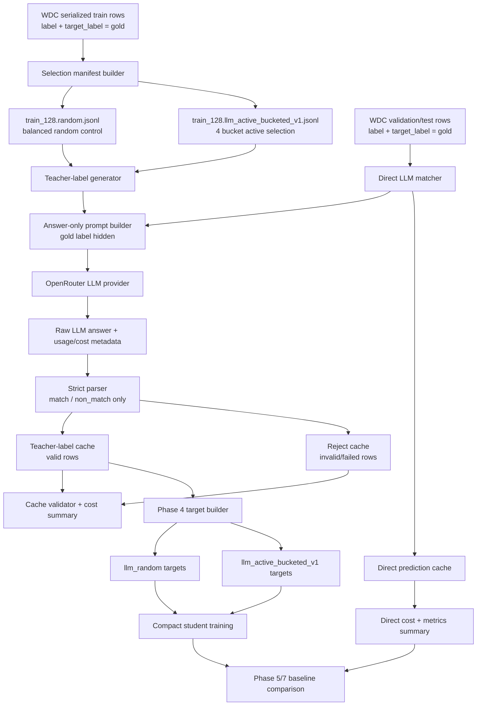

# Phase 3 Flow And Input/Output Report

## Purpose

This report explains the Phase 3 data flow for sanity checking. Phase 3 creates
fixed pair-selection manifests, sends selected or evaluation pairs through an
answer-only LLM matcher, caches valid/invalid outputs, and prepares auditable
cost/quality metadata for later target building and analysis.

Live OpenRouter calls are still pending. The implemented and generated local
artifacts are selection manifests and pipeline code.

## High-Level Flow



## Flow 1: Serialized WDC Rows

| Item | Details |
|---|---|
| Input path | `data/cache/wdc_products/serialized/train.jsonl`, `validation.jsonl`, `test.jsonl` |
| Producer | Phase 1 WDC serialization code |
| Main consumer | selection builder, direct LLM matcher |
| Key fields | `pair_id`, `split`, `label`, `target_label`, `input_text`, `record_a`, `record_b`, `metadata` |
| Gold label location | `label` as `0/1`; `target_label` as `match` or `non-match` |
| LLM visibility | Gold label is not placed in the prompt |

Example conceptual row:

```json
{
  "pair_id": "a#b",
  "split": "train",
  "label": 1,
  "target_label": "match",
  "input_text": "Task: decide whether Record A and Record B...",
  "record_a": {"attributes": {"title": "..."}},
  "record_b": {"attributes": {"title": "..."}},
  "metadata": {"dataset": "wdc_products"}
}
```

Sanity checks:

- `pair_id` must be stable and unique within a split.
- Gold labels are retained for audit/evaluation, not for prompting.
- `input_text` must include both records with field names.

## Flow 2: Selection Manifest Builder

| Item | Random Control | Active Heuristic |
|---|---|---|
| Code | `data/select_active_pairs.py` | `data/select_active_pairs.py` |
| Input | `data/cache/wdc_products/low_label/train_128.jsonl` | `data/cache/wdc_products/serialized/train.jsonl` |
| Output | `data/cache/wdc_products/selection_manifests/train_128.random.jsonl` | `data/cache/wdc_products/selection_manifests/train_128.llm_active_bucketed_v1.jsonl` |
| Strategy | preserve existing balanced sample | select from four label-free WDC candidate buckets |
| Uses gold label for selection? | yes, indirectly, because existing low-label sample is stratified | no |
| Current row count | 128 | 128 |
| Default active allocation | not applicable | 32 rows each from easy-match, hard-match, easy-non-match, hard-negative candidate buckets |
| Gold-label audit | expected balanced from low-label sampler | audit after selection only; not an input to active scoring |

Added fields:

| Field | Meaning |
|---|---|
| `selection_strategy` | `random` or `llm_active_bucketed_v1` |
| `selection_rank` | 1-based rank inside the selected budget |
| `selection_score` | active score; `null` for random |
| `selection_bucket` | active-only bucket name |
| `selection_bucket_rank` | 1-based rank inside the active bucket |
| `selection_bucket_quota` | requested number of rows for that bucket |
| `selection_seed` | fixed seed, currently `42` |
| `selection_budget` | selected budget, currently `128` |
| `selection_uses_gold_label` | whether the selection procedure used gold labels |
| `selection_features` | active-only feature breakdown |

Sanity checks:

- Manifests are fixed before live LLM labels or student results are inspected.
- The active bucket ratio is predeclared as 25 percent per bucket by default.
- The within-bucket score is a transparent heuristic, not a learned selector.
- Gold labels remain in the row for later audit, but active scoring does not use them.
- The active manifest is not guaranteed to be class-balanced.

## Flow 3: Prompt Builder

| Item | Details |
|---|---|
| Code | `supervision/prompts.py` |
| Input | one selected train pair or one validation/test pair |
| Output | answer-only prompt string |
| Mode | `teacher_label` or `direct_prediction` |
| Allowed answers | `match`, `non_match` |
| Gold label visibility | hidden from prompt |

Prompt behavior:

- Includes `pair_id`.
- Includes serialized Record A and Record B.
- Asks for exactly one label.
- Forbids explanation, JSON, and punctuation.

Sanity checks:

- Prompt must not include `label`, `target_label`, or `gold_label`.
- Same prompt family is used for teacher labeling and direct LLM matching.
- Prompt version is fixed as `answer_only_v1`.

## Flow 4: OpenRouter LLM Provider

| Item | Details |
|---|---|
| Code | `supervision/llm_providers.py` |
| Input | system prompt + user prompt |
| Output | normalized `LLMResponse` |
| Default provider | OpenRouter chat completions |
| Default model | `openai/gpt-4o-mini` |
| Default temperature | `0.0` |

Provider output fields:

| Field | Meaning |
|---|---|
| `raw_answer` | raw model text |
| `input_tokens` | provider usage prompt/input tokens |
| `output_tokens` | provider usage completion/output tokens |
| `estimated_cost_usd` | provider cost or configured pricing estimate |
| `response_model` | model returned by provider |
| `provider_response_id` | provider response id |
| `metadata` | usage and provider details |

Sanity checks:

- Temperature must remain `0.0` unless changed before results are inspected.
- Token/cost metadata should be retained even if answer parsing fails.
- Live calls require `OPENROUTER_API_KEY`.

## Flow 5: Teacher-Label Generator

| Item | Details |
|---|---|
| Code | `supervision/generate_teacher_labels.py` |
| Input | selected-pair manifest JSONL |
| Output valid | teacher-label cache JSONL |
| Output invalid | reject cache JSONL |
| Resume behavior | reuses cached valid rows for same prompt/model |

Expected inputs:

```text
data/cache/wdc_products/selection_manifests/train_128.random.jsonl
data/cache/wdc_products/selection_manifests/train_128.llm_active_bucketed_v1.jsonl
```

Expected outputs:

```text
data/cache/wdc_products/teacher_labels/train_128.random.openrouter.answer_only_v1.labels.jsonl
data/cache/wdc_products/teacher_labels/train_128.random.openrouter.answer_only_v1.rejects.jsonl
data/cache/wdc_products/teacher_labels/train_128.llm_active_bucketed_v1.openrouter.answer_only_v1.labels.jsonl
data/cache/wdc_products/teacher_labels/train_128.llm_active_bucketed_v1.openrouter.answer_only_v1.rejects.jsonl
```

Valid cache row meaning:

| Field | Meaning |
|---|---|
| `label` | parsed LLM teacher label |
| `gold_label` | dataset gold label copied for audit/evaluation |
| `raw_answer` | raw model output |
| `valid` | parser result |
| `selection_*` | selection metadata copied from manifest |
| `input_tokens`, `output_tokens`, `estimated_cost_usd` | cost fields |

Important distinction:

```text
label      = LLM teacher output
gold_label = original WDC truth
```

Sanity checks:

- Invalid LLM answers go to reject cache.
- Valid rows must have `label`.
- Invalid rows must not have `label`.
- `gold_label` is used for teacher-noise analysis, not for prompting.
- Cache filenames should include the selection strategy.

## Flow 6: Strict Parser And Reject Routing

| Item | Details |
|---|---|
| Code | `supervision/prompts.py`, `supervision/generate_teacher_labels.py` |
| Input | `raw_answer` |
| Valid outputs | `match`, `non_match`, quoted forms, `non-match` normalized |
| Invalid outputs | explanations, punctuation, uncertainty, malformed text |

Examples:

| Raw answer | Parsed label | Valid? |
|---|---|---|
| `match` | `match` | yes |
| `"non-match"` | `non_match` | yes |
| `match.` | null | no |
| `The answer is match` | null | no |
| `uncertain` | null | no |

Sanity checks:

- Parser is intentionally strict to keep invalid-output rate measurable.
- Reject rows preserve errors for later inspection.

## Flow 7: Cache Validator And Cost Summary

| Item | Details |
|---|---|
| Code | `supervision/validate_teacher_labels.py`, `analysis/cost_summary.py` |
| Input | teacher-label, reject, or direct-prediction JSONL |
| Output | printed JSON summary |

Summary fields:

| Field | Meaning |
|---|---|
| `rows` | schema-valid rows summarized |
| `valid_count`, `invalid_count`, `invalid_rate` | validity stats |
| `duplicate_pair_ids` | repeated pair IDs |
| `label_distribution` | distribution of valid LLM labels |
| `gold_label_distribution` | gold-label distribution when present |
| `selection_strategy_distribution` | random vs active rows |
| `input_tokens`, `output_tokens` | token totals |
| `estimated_total_cost_usd` | total estimated cost |
| `estimated_cost_per_valid_label_usd` | cost divided by valid rows |

Sanity checks:

- Validate caches before target building.
- Check active vs random label distributions separately.
- Check invalid rate before trusting teacher labels.
- Check duplicate pair IDs before training.

## Flow 8: Direct LLM Matcher

| Item | Details |
|---|---|
| Code | `supervision/direct_llm_matcher.py` |
| Input | validation/test serialized JSONL |
| Output | direct LLM prediction cache + cost JSON |
| Purpose | repeated-inference cost and quality baseline |

Expected first input:

```text
data/cache/wdc_products/serialized/validation.jsonl
```

Expected outputs:

```text
outputs/distiller_wdc/direct_llm/validation.openrouter.answer_only_v1.predictions.jsonl
outputs/distiller_wdc/direct_llm/validation.openrouter.answer_only_v1.cost.json
```

Cache row meaning:

```text
label      = direct LLM prediction
gold_label = original WDC truth
```

Sanity checks:

- Use full validation split if budget allows.
- Otherwise declare fixed `--limit N --sample-seed 42` before inspecting results.
- Direct LLM matcher does not train a student.
- Direct LLM cost grows with every prediction, unlike distilled-student inference.

## Flow 9: Phase 4 Handoff

| Item | Details |
|---|---|
| Input | validated teacher-label caches |
| Consumer | `supervision/build_targets.py` extension in Phase 4 |
| Output | compact-student target JSONL |

Expected future target variants:

| Variant | Training label source |
|---|---|
| `llm_random` | valid labels from `train_128.random` teacher cache |
| `llm_active_bucketed_v1` | valid labels from `train_128.llm_active_bucketed_v1` teacher cache |
| `mixed_gold_llm_active` | optional gold seed plus active LLM labels |

Sanity checks:

- Validation/test targets must use gold labels.
- Student training targets for LLM variants must use LLM `label`, not `gold_label`.
- Invalid teacher rows should be excluded or explicitly handled before training.

## Current Artifact Status

| Artifact | Status |
|---|---|
| `train_128.random` manifest | exists, 128 rows |
| `train_128.llm_active_bucketed_v1` manifest | exists, 128 rows after local regeneration |
| Random teacher-label cache | pending live OpenRouter call |
| Active teacher-label cache | pending live OpenRouter call |
| Direct validation prediction cache | pending live OpenRouter call |
| Validator/cost summary code | implemented |
| Unit tests | passing as of last run: 17 tests |

## End-To-End Sanity Checklist

- [ ] Manifests are fixed and versioned before LLM calls.
- [ ] Prompt does not expose gold labels.
- [ ] Teacher-label cache stores both LLM `label` and dataset `gold_label`.
- [ ] Direct LLM cache stores both LLM `label` and dataset `gold_label`.
- [ ] Invalid model outputs are measurable, not silently coerced.
- [ ] Token and cost fields are present for every LLM call when provider returns usage.
- [ ] Selection strategy is present in teacher-label caches.
- [ ] Random and active teacher-label caches are validated separately.
- [ ] Phase 4 target builder uses teacher `label` for LLM variants.
- [ ] Validation/test evaluation uses gold labels.

## Commands For Sanity Check

Preferred wrapper:

```bash
scripts/run_phase03_reproducible.sh local
```

This regenerates the fixed manifests and runs unit tests without live LLM/API
calls. Live OpenRouter runs are available through explicit subcommands:

```bash
scripts/run_phase03_reproducible.sh teacher-all
scripts/run_phase03_reproducible.sh direct
scripts/run_phase03_reproducible.sh validate
```

Underlying commands:

```bash
.venv/bin/python -m data.select_active_pairs \
  --input data/cache/wdc_products/low_label/train_128.jsonl \
  --budget 128 \
  --strategy random

.venv/bin/python -m data.select_active_pairs \
  --input data/cache/wdc_products/serialized/train.jsonl \
  --budget 128 \
  --strategy llm_active_bucketed_v1 \
  --easy-match-ratio 0.25 \
  --hard-match-ratio 0.25 \
  --easy-non-match-ratio 0.25 \
  --hard-negative-ratio 0.25

.venv/bin/python -m supervision.generate_teacher_labels \
  --pairs data/cache/wdc_products/selection_manifests/train_128.random.jsonl \
  --model openai/gpt-4o-mini \
  --temperature 0.0

.venv/bin/python -m supervision.generate_teacher_labels \
  --pairs data/cache/wdc_products/selection_manifests/train_128.llm_active_bucketed_v1.jsonl \
  --model openai/gpt-4o-mini \
  --temperature 0.0

.venv/bin/python -m supervision.direct_llm_matcher \
  --input data/cache/wdc_products/serialized/validation.jsonl \
  --model openai/gpt-4o-mini \
  --temperature 0.0
```
